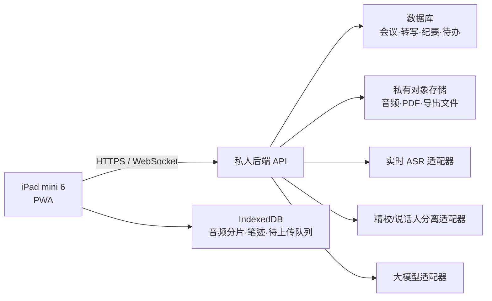

# iPad mini 6 会议智能办公本可行性评估与设计报告

> 版本：1.0  
> 日期：2026-08-20  
> 用途：个人使用  
> 目标设备：iPad mini 6 + Apple Pencil  
> 调研基础：[科大讯飞智能办公本功能全景](../../../科大讯飞智能办公本功能全景.md)

## 1. 结论摘要

本项目可行，推荐做成 **可安装 PWA + 私人后端 + 可替换 AI 服务**，而不是普通网页或原生 iPad App。

该方案无需 Xcode，无需付费 Apple Developer 账号，可通过 Safari 的“添加到主屏幕”获得接近 App 的启动与全屏体验。它能实现会议列表、Apple Pencil 手写、前台录音、实时转写、会后精校、说话人分离、音频/转写/笔迹时间轴、AI 纪要、待办提取、搜索与导出，形成完整的会议记录闭环。

三项能力不能与讯飞专用硬件等价复制：

- PWA 不能保证锁屏或长时间切到后台后持续录音。
- iPad 的麦克风不能可靠复制多麦阵列的声源方向雷达。
- 不复制物理断网拨键、独立指纹保密箱、端侧大模型和墨水屏。

在“个人使用、允许联网、会议期间尽量保持前台”的前提下，这些差异不阻碍项目达成核心目标。

## 2. 目标与范围

### 2.1 产品目标

把 iPad mini 6 变成一台个人会议工作台，完成以下主链路：

```text
创建会议
  -> 前台录音 + Apple Pencil 手写 + 实时转写
  -> 完整音频精校 + 说话人分离
  -> AI 规整 + 会议纪要 + 决策/风险/待办
  -> 人工校正 + 搜索 + 导出
```

### 2.2 纳入范围

- 会议列表、文件夹、搜索和会议状态。
- Apple Pencil 手写，包括钢笔、荧光笔、橡皮、撤销、重做和套索。
- 前台录音、分片保存、断网续传和异常恢复。
- 实时转写、会后高精度转写、说话人分离和重命名。
- 录音、转写和笔迹的统一时间轴。
- 转写校正、音频回放、笔迹/文本定位音频。
- AI 文本规整、议题提取、会议纪要、决策、风险和行动项。
- Markdown、PDF、纯文本和音频导出。
- 本地缓存、云端备份和 AI API 配置。

### 2.3 明确排除

- 个人知识库、向量问答和跨资料聚合。
- 电子书、PDF 阅读器、听书和文档批注。
- 通用日历、邮件、Office 编辑、扫描和新闻。
- 注册、团队、组织权限、会议共享和多人协作。
- App Store 发布、原生 iPadOS 安装包和付费 Apple Developer 账号。

## 3. 形态评估与技术选型

| 方案 | 优点 | 主要问题 | 结论 |
|---|---|---|---|
| 原生 iPad App | 录音、文件和 Pencil 能力上限最高 | 需要 Mac/Xcode；免费签名不适合长期稳定自用；分发通常涉及开发者计划 | 当前不选 |
| 普通联网网页 | 开发和部署简单 | 启动、离线、缓存和恢复体验弱 | 不选 |
| 可安装 PWA + 后端 | 无需 Xcode；可安装；支持本地缓存和私有后端；迭代方便 | 不能保证锁屏/后台录音 | **选定** |

PWA 仍然是 HTML/CSS/JavaScript 应用，但它增加了可安装清单、Service Worker、离线应用外壳和本地数据层，因此不应按“打开一个网页”的标准实现。

## 4. 系统架构



### 4.1 PWA 前端

- 会议列表、现场会议、会后复盘、AI 纪要、导出和设置界面。
- Canvas 手写引擎，保存结构化笔迹，而不是只保存一张图片。
- 录音控制、媒体格式协商、分片缓存、上传队列和恢复控制。
- 用户交互开启麦克风；录音期间尝试使用 Screen Wake Lock 保持亮屏。
- Service Worker 缓存应用外壳，IndexedDB 保存未同步数据。

### 4.2 私人后端

- 单用户身份认证、会议数据、分片上传、状态管理和导出。
- 合并、转码和校验音频；对 Safari 实际支持的 MIME 格式做运行时适配。
- 保存 AI 服务密钥，调用实时转写、批量转写、说话人分离和大模型。
- 每个耗时步骤独立排队、记录进度和重试，避免一个步骤失败导致全流程重来。

### 4.3 AI 服务适配器

系统定义四个可替换边界：

- `RealtimeASRProvider`：实时音频流转写。
- `BatchASRProvider`：完整录音高精度转写。
- `DiarizationProvider`：说话人分离；可与批量转写由同一供应商实现。
- `LLMProvider`：文本规整、议题、纪要和行动项。

这些边界允许按实际 API 质量和费用组合服务，不要求所有能力由同一家供应商完成。

## 5. 界面与模块边界

### 5.1 会议列表

作为应用首页，显示历史会议、文件夹、搜索、处理状态和“新建会议”。不设宣传落地页。

### 5.2 会议现场

采用已确认的 **C：自适应浮层** 布局：

- 手写画布始终是主区域。
- 横屏使用可收起、可调整的实时转写浮层。
- 竖屏自动改为底部抽屉，收起时保留最新转写提示。
- 顶部固定显示录音状态、时长、网络、本地保存和上传状态。
- 不因转写失败锁住录音或手写。

### 5.3 会后复盘

展示音频时间轴、精校转写、说话人、手写内容和处理进度。点击转写段或笔迹时，播放头跳到关联时间。

### 5.4 AI 纪要

展示摘要、议题、结论、决策、风险和待办。所有结构化项都允许人工修改，并可跳回原转写证据。

### 5.5 导出与设置

导出 Markdown、PDF、纯文本和音频。设置页只管理单用户账号、AI 供应商、存储、数据保留和设备缓存，不扩展成通用管理后台。

## 6. 会议数据流

### 6.1 录音期间

1. 用户点击开始，系统创建会议和单调递增的会议时钟。
2. 麦克风音频按 10 秒分片，每片先写入 IndexedDB，再异步上传。
3. 实时 ASR 经后端连接，产生带开始/结束时间的临时转写段。
4. 每段笔迹保存坐标、压力、工具、颜色、页码和会议时钟范围。
5. 笔迹、转写和音频不直接互相依赖，只共享同一时间基准，任一子系统失败不阻塞其他子系统。

### 6.2 会后处理

1. 服务端校验分片序号和哈希，发现缺片时先要求 iPad 补传。
2. 合并并标准化完整音频，保留原始文件。
3. 运行批量高精度转写和说话人分离，替换现场临时转写，但保留版本用于审查。
4. 用户可重命名说话人和修改文本。
5. AI 对精校文本生成规整版和结构化纪要。
6. 导出始终使用当前人工确认版本，不使用已过期的 AI 中间结果。

## 7. 核心数据对象

- `Meeting`：标题、文件夹、开始/结束时间、状态、时长、时钟版本和处理进度。
- `AudioChunk`：序号、时间范围、MIME、大小、哈希、本地/远端状态和重试次数。
- `InkStroke`：点集、压力、工具、样式、页码、开始/结束时间和编辑版本。
- `TranscriptSegment`：文本、时间范围、说话人、来源、置信度和修订历史。
- `Speaker`：会议内部标识、显示名称和人工确认状态。
- `Minutes`：摘要、议题、结论、决策、风险、模型/提示词版本和生成时间。
- `ActionItem`：内容、负责人、截止日期、状态、证据转写段和待确认字段。

## 8. 讯飞会议功能的 iPad 实现可行性

| 功能 | 可行性 | 实现方式与边界 |
|---|---|---|
| 会议列表、文件夹、搜索 | 高 | IndexedDB 本地索引 + 后端数据库同步 |
| Apple Pencil 手写 | 高 | Canvas + Pointer Events，记录坐标、压力和时间 |
| 钢笔、荧光笔、橡皮 | 高 | 结构化笔迹、独立图层和混合模式 |
| 撤销、重做、套索 | 高 | 笔迹操作历史和空间命中检测 |
| 前台录音 | 高 | Safari `MediaRecorder`；需 HTTPS、用户授权和前台运行 |
| 10 秒分片和断网补传 | 高 | IndexedDB 持久队列 + 幂等上传 |
| 锁屏/后台持续录音 | 低 | PWA 无法保证；要求前台亮屏并标记中断 |
| 实时语音转写 | 高 | 音频流经后端连接实时 ASR |
| 会后高精度转写 | 高 | 完整音频合并后重新识别 |
| 多说话人分离 | 中高 | 云端聚类为说话人 A/B/C，质量受重叠发言和收音影响 |
| 真实姓名自动识别 | 中 | 默认不猜姓名；用户重命名后在当前会议统一替换 |
| 声源方向雷达 | 低 | 单台 iPad 无法稳定复制专用多麦阵列 |
| 音频、转写、笔迹同步 | 高 | 统一会议时钟和带时间范围的事件 |
| 点击笔迹跳转录音 | 高 | 使用笔迹开始/结束时间设置播放头 |
| 转写纠错和说话人修改 | 高 | 可编辑段落、标签和修订历史 |
| AI 文本规整和议题提取 | 高 | 对精校转写调用大模型 |
| AI 会议纪要 | 高 | 结构化 Schema 输出 + 证据引用 + 人工修改 |
| 决策、风险、待办 | 高 | 独立结构化字段，与原转写段关联 |
| 负责人和截止日期 | 中高 | AI 提取；不明确时标记“待确认”，禁止猜测 |
| Markdown/文本导出 | 高 | 服务端模板生成 |
| PDF 导出 | 高 | HTML 打印模板生成并验证中文字体 |
| 音频导出 | 高 | 服务端合并分片并提供原始/兼容格式 |
| 本地缓存和云端备份 | 高 | Service Worker、IndexedDB、数据库和私有对象存储 |
| 物理断网、指纹保密箱、本地大模型 | 不实现 | 非会议核心范围，且无法用 PWA 复制专用硬件 |

## 9. 异常恢复与防丢机制

- 分片先落本地、后上传；只有 IndexedDB 写入成功后才将该片标记为已捕获。
- 服务端以会议 ID + 分片序号作为幂等键，并校验哈希，重试不产生重复音频。
- 笔迹、转写和时间锚点增量保存，不等待整场会议结束。
- 断网时录音和手写继续，待上传数据进入持久队列，联网后自动补传。
- 实时转写失败不影响录音，会后仍以完整录音重新精校。
- 启动时检查未正常结束的会议，允许“继续恢复”或“结束并处理”。
- 会议状态为：录音中、待恢复、上传中、AI 处理中、已完成、处理失败。
- 每个失败步骤可单独重试，不重新上传已校验音频。
- 录音前检查本地可用空间；空间不足时禁止开始长会议，并指引先清理已上传缓存。
- 录音期间启用亮屏请求并在退出/刷新前警告。若 iPadOS 仍挂起页面，恢复后显式标记缺口范围，不伪造连续录音。
- 删除的会议进入回收站，保留 30 天后再彻底删除。

> iOS 可能在存储压力下清理网站数据，浏览器持久存储请求也不是绝对保证。因此“先本地、尽快上传、服务端校验”三者缺一不可。

## 10. AI 输出约束

- 实时转写只是现场参考；高精度批量转写是会后基础文本。
- 文本规整必须保留原意，已删除语气词或重复内容仍可回看原转写。
- 纪要使用结构化 Schema，每个决策、风险和行动项保存原转写证据 ID。
- 没有证据的结论不得写入正式纪要。
- 负责人、截止日期或说话人姓名不明确时，输出 `待确认`，不允许模型猜测。
- 用户修改转写后，旧纪要标记为已过期，用户可选择重新生成。
- 保存供应商、模型、参数、提示词版本和生成时间，便于重现和比较质量。

## 11. 部署与安全

- PWA 和 API 都使用 HTTPS；麦克风和 Service Worker 要求安全上下文。
- 前端与后端使用固定受信域名，后端限制 CORS 和上传类型/大小。
- 采用单用户登录，优先通行密钥，保留恢复密码；不开发公开注册。
- AI API 密钥仅保存在后端密钥管理中，不返回前端，不写入日志。
- 数据库保存会议元数据；音频和导出文件使用私有对象存储，下载采用短时授权。
- 浏览器本地数据不在退出登录时自动删除，只通过明确的“清除此设备数据”操作删除。
- 每日备份数据库，定期扫描对象存储中音频的存在性和哈希完整性。
- 日志记录请求 ID、会议 ID、分片序号、耗时和错误码，不默认记录完整转写和 AI 密钥。

## 12. 验收基线

| 场景 | 验收要求 |
|---|---|
| 安装启动 | Safari 添加到主屏幕后可独立启动；已安装时断网也能进入会议列表 |
| 录音稳定性 | iPad mini 6 前台亮屏连续录音 2 小时，音频可完整播放，无未标记缺口 |
| 断网恢复 | 断网 15 分钟仍能录音和手写，联网后自动补传且分片不重复 |
| 异常退出 | 强制关闭后重新打开，能恢复未完成会议及本地分片 |
| 手写体验 | Apple Pencil 笔迹连续、压力有效，缩放或转屏不丢失笔迹 |
| 手写工具 | 钢笔、荧光笔、橡皮、套索、撤销和重做均可稳定使用 |
| 实时转写 | 正常网络下，语音到屏幕文字的延迟目标不超过 5 秒 |
| 精校转写 | 普通话安静会议的字准率目标不低于 90%，最终以候选 API 在真实样本上的对比测试为准 |
| 说话人分离 | 2–4 人轮流发言时能稳定区分；重叠发言允许标记为不确定 |
| 时间同步 | 点击转写或笔迹跳转录音，时间误差不超过 2 秒 |
| AI 纪要 | 摘要、决策、风险和待办可追溯到原转写；不确定负责人/日期不得猜测 |
| 人工校正 | 转写、说话人、纪要和待办均能编辑，刷新后不丢失 |
| 导出 | Markdown、PDF、纯文本和音频可正常打开，中文无乱码 |
| 数据安全 | 前端资源、网络响应和浏览器本地存储中不出现真实 AI API 密钥 |
| 屏幕适配 | 横屏使用转写浮层，竖屏使用底部抽屉，控件无重叠或溢出 |
| 限制提示 | 录音前明确提示锁屏、切换应用或系统挂起风险 |

测试分为单元测试、前后端接口测试、AI 供应商合同测试、断网/崩溃恢复测试和 iPad mini 6 真机验收。麦克风、Apple Pencil、锁屏和长时间录音不能只使用桌面浏览器模拟。

## 13. 主要风险与应对

| 风险 | 影响 | 应对 |
|---|---|---|
| iPadOS 挂起 PWA | 录音中断 | 亮屏请求、前台警告、缺口检测；不宣称支持锁屏录音 |
| Safari 媒体格式/分片差异 | 服务商拒绝音频 | 运行时 MIME 探测，保留原片，后端统一转码 |
| 本地存储被清理 | 未上传数据丢失 | 录音前容量检查、尽快上传、服务端逐片确认 |
| 实时 ASR 断线 | 现场文字中断 | 独立重连，不影响录音，会后整体重转 |
| 说话人分离不稳定 | 角色归属错误 | 供应商样本对比、置信度标记、人工重命名/合并 |
| AI 幻觉 | 纪要出现未发生事实 | Schema 约束、强制证据引用、待确认状态和人工定稿 |
| 单一 AI 服务商变更 | 成本或可用性变化 | 标准化适配器和供应商合同测试 |
| 音频上传耗时/成本 | 会后等待较长 | 分片并行续传、进度显示、可配置保留周期 |

## 14. 最终建议

1. 按已确认的 PWA 架构实施，不为了“像 App”引入 Xcode 和签名维护成本。
2. 第一优先级是录音防丢和可恢复，第二是统一时间轴，第三才是 AI 生成纪要。
3. 先用真实中文会议样本对比候选 ASR/说话人服务，再锁定默认供应商；不以 API 宣传页代替实测。
4. 对用户明确保留“前台亮屏录音”的使用约束。若日后必须支持锁屏或后台录音，再单独评估原生包装或原生 App，不改动现有后端和数据模型。

综合判断：**该项目适合开发，并且 PWA 是当前约束下最合理的产品形态。**
