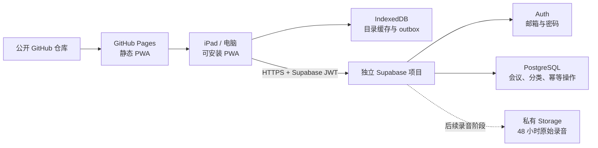

# 会议本 Supabase 与 GitHub Pages 免费部署设计

> 状态：已确认
> 日期：2026-08-22
> 用途：个人使用
> 当前阶段：会议目录、会议笔记基础与离线同步的云端迁移

## 1. 结论

会议本改为 **GitHub Pages 静态 PWA + 独立 Supabase 项目**。GitHub Pages 提供免费 HTTPS 页面，Supabase 提供邮箱登录、PostgreSQL 数据库和后续需要的私有文件存储。生产环境不再依赖常开 Mac、Tailscale、付费 Node 服务器或当前 SQLite API。

该部署只迁移已经完成的会议目录基础能力，不提前实现录音、转写或 AI 总结。后续录音阶段遵守已经确认的数据保留规则：原始录音在云端和 iPad 本地统一保留 48 小时，会议笔记、完整转写和 AI 总结永久保存。

## 2. 用户体验

1. 用户在 iPad Safari 打开 GitHub Pages 的 HTTPS 地址。
2. 使用邮箱和密码登录独立的会议本 Supabase 项目。
3. 可将页面“添加到主屏幕”，以独立 PWA 方式启动。
4. 离线时继续查看和修改会议目录；操作先写入 IndexedDB outbox。
5. 联网后自动同步到 Supabase，电脑和 iPad 登录同一账号即可看到相同数据。
6. 同步冲突继续使用现有冲突提示与“放弃本地修改”入口，不静默覆盖数据。

## 3. 选定架构

### 3.1 GitHub Pages

- 使用公开 GitHub 仓库免费发布静态页面。
- 仓库只包含源代码、数据库迁移和部署流程，不包含用户数据、密码、AI 密钥或 Supabase service role key。
- GitHub Actions 在 `main` 更新后运行测试和构建，并发布 `apps/web/dist`。
- Vite、PWA manifest、图标、Service Worker 的路径按仓库子路径配置，确保安装、刷新和离线启动正常。
- Supabase Project URL 和 anon/publishable key 作为构建配置注入。anon/publishable key 本身是前端公开标识，真正的数据保护依赖 Auth 和 RLS。

### 3.2 Supabase Auth

- 登录方式为邮箱加密码。
- 初始用户由部署过程在 Supabase 中建立并确认，生产应用不提供公开注册入口。
- Supabase SDK 管理短期访问令牌和刷新令牌；应用不保存明文密码。
- 未登录用户只能看到登录页，不能读取或修改任何会议数据。

### 3.3 PostgreSQL 与 RLS

- `folders`、`meetings` 和 mutation replay 数据都增加 `user_id`，并以 `auth.uid()` 作为所有权边界。
- 每张业务表启用 Row Level Security；已认证用户只能访问 `user_id = auth.uid()` 的记录。
- 客户端不能自行指定其他用户的 `user_id`，写入函数从 JWT 上下文读取当前用户。
- 数据库迁移文件纳入版本控制，可在新 Supabase 项目中重复部署和审查。

### 3.4 离线同步与冲突

现有 Dexie 本地目录、outbox、稳定 operation ID、pending 状态和冲突 UI 保留。远端适配器从 Fastify REST API 改为 Supabase 查询和 PostgreSQL RPC：

- pull 使用当前用户范围内的 `folders` 和 `meetings` 查询。
- mutation RPC 在一个数据库事务内完成幂等检查、`expectedSyncVersion` 条件写入和 replay 结果保存。
- `operation_id + user_id` 唯一，响应丢失后可安全重放。
- 版本不一致或目标实体已被远端删除时返回明确的 typed conflict，由现有 UI 处理。
- 认证过期暂停同步，Supabase session 刷新成功后再恢复，不删除本地 outbox。

## 4. 数据边界

本次迁移的数据对象：

- 分类：名称、回收状态、同步版本和更新时间。
- 会议：标题、分类、回收状态、同步版本和更新时间。
- mutation replay：operation ID、操作类型、请求指纹和确定性响应。

本次不创建伪录音、伪转写或伪 AI 字段。录音、转写、总结和手写仍属于后续独立阶段。

## 5. 录音保留规则

后续录音阶段必须实现以下规则：

- 原始录音以会议结束时间为基准保留 48 小时。
- 云端通过定时清理任务删除到期 Storage object，并保留可审计的删除结果，不保留可恢复副本。
- iPad 在应用运行时检查到期时间；如果应用在到期时完全关闭，则在下一次启动或恢复前台时立即删除本地过期录音。
- 删除原始录音不得级联删除会议笔记、完整转写或 AI 总结。
- 录音上传失败时仍以本地创建时间计算保留期，不能通过持续失败无限延长本地保留。
- 以每周三场、每场一小时估算，48 小时窗口内的压缩录音远低于 Supabase 免费的 1 GB 文件存储；文字数据远低于免费数据库额度。

## 6. AI 与 API 密钥边界

当前阶段不调用 AI，也不要求填写 AI API。

后续 AI 阶段提供应用内设置界面，但设置界面只把密钥提交给已认证的服务端函数。真实 API 密钥不得写入 IndexedDB、localStorage、前端 bundle、GitHub 仓库或普通日志。服务端函数负责调用转写和总结供应商，Supabase 本身不自动提供 AI 总结。

## 7. 错误与恢复

- 无网络：保持本地 optimistic 数据和 outbox，恢复联网后自动重试。
- Supabase session 失效：停止远端写入并回到登录门，本地未同步数据不丢失。
- RLS 拒绝：显示权限错误并停止当前同步批次，不把它误判为版本冲突。
- 条件写冲突：保存 typed conflict，允许用户查看并放弃冲突点及其后续同实体操作。
- RPC 响应丢失：使用稳定 operation ID 重放并得到相同结果。
- GitHub Pages 更新：Service Worker 使用现有 auto-update 策略，API 请求不进入 Cache Storage。

## 8. 安全约束

- 所有生产访问使用 HTTPS。
- 所有业务表和 Storage bucket 默认私有并启用 RLS。
- 前端只使用 anon/publishable key，不使用 service role key。
- 密码、AI 密钥和 service role key 不进入 GitHub Actions 构建产物。
- 公开仓库和公开页面不等于公开数据；数据访问必须同时通过 Supabase Auth 和 RLS。
- 独立 Supabase 项目与个人平台数据隔离，避免迁移、RLS 或清理任务相互影响。

## 9. 测试与验收

### 9.1 自动验证

- Supabase auth adapter 的登录、登出、session 恢复和过期测试。
- PostgreSQL/RPC 的 RLS、幂等 replay、条件版本冲突和 typed not-found conflict 测试。
- 真实 Dexie + Supabase adapter 的离线写入、重连 flush、pull 和 conflict resolve 测试。
- GitHub Pages 子路径下的 manifest、Service Worker、离线启动和 API 不缓存测试。
- 前端 bundle 敏感信息扫描。

### 9.2 部署验收

- iPad Safari 可打开 Pages 地址并完成邮箱登录。
- “添加到主屏幕”后以 standalone PWA 启动。
- iPad 离线创建或修改目录，联网后在电脑端可见。
- 电脑端修改后 iPad pull 到新版本。
- 未登录访问、其他账号访问和直接查询都不能读取当前用户数据。
- 公开 GitHub 仓库和构建产物中不存在密码、会议内容或私密 API key。

### 9.3 后续录音阶段验收

- 云端录音在会议结束 48 小时后被定时删除。
- iPad 关闭超过 48 小时后重新打开，过期本地录音在进入会议内容前删除。
- 删除后笔记、转写和总结仍可正常查看与同步。

## 10. 实施边界与顺序

1. 建立独立 Supabase schema、RLS 和 mutation RPC。
2. 将 Web auth 和 catalog remote adapter 切换到 Supabase，保留 Dexie 离线层。
3. 增加 GitHub Pages 子路径构建与 Actions 部署。
4. 在本地、桌面浏览器和真实 iPad 上完成同步与安装验收。
5. 验收通过后再进入录音、转写和 AI 阶段。

不在本次迁移中实现录音、手写、转写、AI 总结或 API 密钥设置界面。
